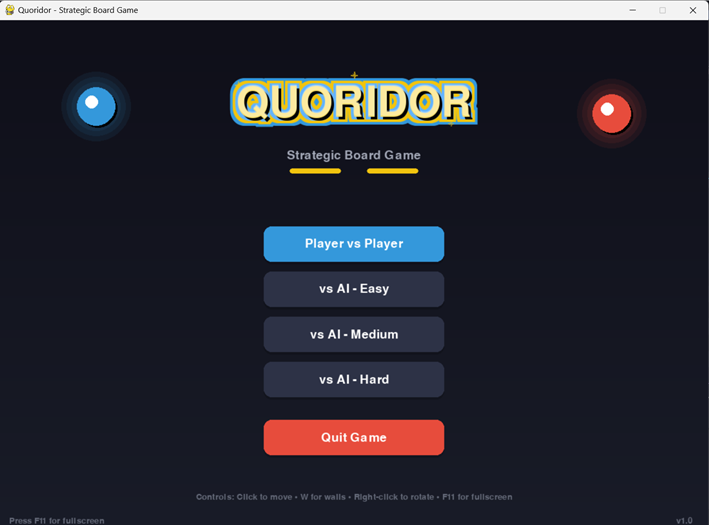
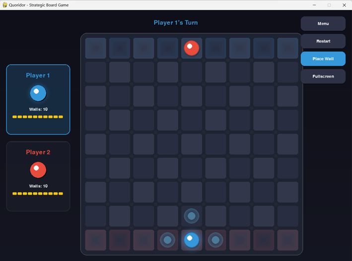
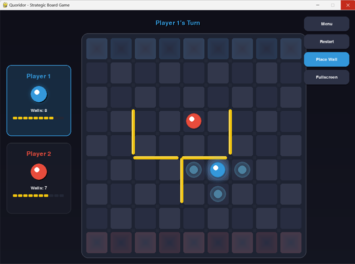
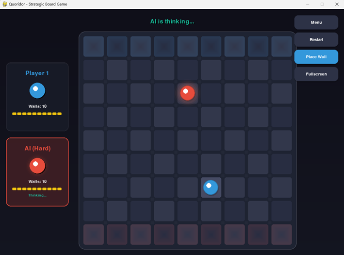
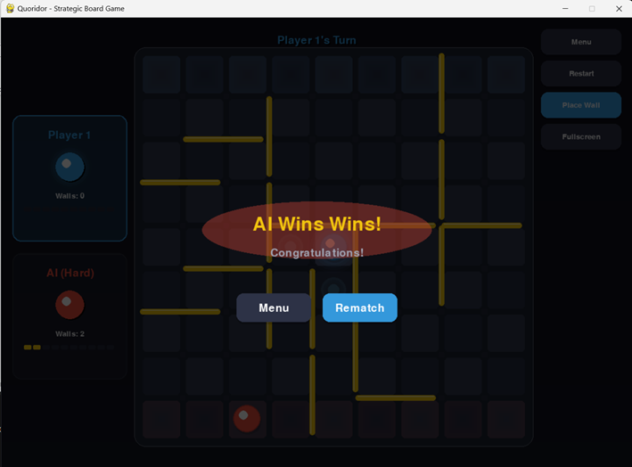

# Quoridor Game

A modern Python implementation of the classic Quoridor board game with a beautiful graphical interface.


## 🎮 About the Game

Quoridor is a strategic two-player board game where the goal is to be the first to reach the opposite side of the board. Players can either move their pawn or place walls to block their opponent's path.

### Rules

1. **Board**: 9x9 grid
2. **Goal**:
   - Player 1 (Blue): Reach the top row
   - Player 2 (Red): Reach the bottom row
3. **Each Turn**: Move your pawn OR place a wall
4. **Walls**: Each player has 10 walls. Walls are 2 cells long and block movement.
5. **Important**: You cannot completely block a player's path to their goal

## 🚀 Installation

### Prerequisites

- Python 3.8 or higher
- pip (Python package manager)

### Steps

1. Clone or download this repository

2. Install dependencies:

   ```bash
   pip install -r requirements.txt
   ```

3. Run the game:
   ```bash
   python main.py
   ```

## 🎯 How to Play

### Controls

| Action           | Control                                 |
| ---------------- | --------------------------------------- |
| Move pawn        | Click on highlighted cells              |
| Toggle wall mode | Press `W` or click "Toggle Wall" button |
| Rotate wall      | Right-click while in wall mode          |
| Cancel wall mode | Press `ESC`                             |
| Return to menu   | Click "Menu" button                     |
| Restart game     | Click "Restart" button                  |

### Game Modes

- **Player vs Player**: Two human players take turns
- **Player vs AI (Easy)**: Play against a beginner AI
- **Player vs AI (Medium)**: Play against a moderate AI
- **Player vs AI (Hard)**: Play against a challenging AI with Minimax algorithm

## 🧠 AI Implementation

The AI uses the **Minimax algorithm with Alpha-Beta pruning** for decision making:

- **Easy**: Random moves with basic goal-seeking
- **Medium**: Minimax with depth 2
- **Hard**: Minimax with depth 3 and strategic wall placement

### Evaluation Function

The AI considers:

- Path length difference (shorter path to goal is better)
- Wall advantage (having more walls remaining)
- Center control (being in the middle columns)
- Progress towards goal

## 📁 Project Structure

```
quoridor_game/
├── main.py                 # Entry point - run this to play
├── requirements.txt        # Dependencies (pygame)
├── README.md              # This file
└── src/
    ├── __init__.py        # Package initialization
    ├── constants.py       # Game constants, colors, settings
    ├── game_logic.py      # Core game mechanics & rules
    ├── ai.py              # AI opponent (Minimax + Alpha-Beta)
    ├── ui_components.py   # Reusable UI components (buttons, panels)
    ├── board_renderer.py  # Board rendering with animations
    ├── screens.py         # Screen management (menu, game over)
    └── gui.py             # Main GUI orchestration
```

### Module Descriptions

| Module              | Description                                                         |
| ------------------- | ------------------------------------------------------------------- |
| `constants.py`      | Centralized configuration for colors, dimensions, and game settings |
| `game_logic.py`     | Core Quoridor rules: movement, wall placement, win conditions       |
| `ai.py`             | AI player with Minimax algorithm and strategic evaluation           |
| `ui_components.py`  | Modern UI widgets: buttons, panels, progress bars, tooltips         |
| `board_renderer.py` | Visual rendering of the game board with smooth animations           |
| `screens.py`        | Menu screen and game-over overlay management                        |
| `gui.py`            | Main game loop and event handling orchestration                     |

## 🎨 Features

- ✅ **Modern Glassmorphism UI** - Beautiful dark theme with glass effects
- ✅ **Smooth Animations** - Pawn movement, hover effects, and transitions
- ✅ **Valid Move Highlighting** - Pulsing indicators for available moves
- ✅ **Wall Placement Preview** - Visual feedback with valid/invalid states
- ✅ **Animated Player Panels** - Glowing effects for current player
- ✅ **Wall Progress Bars** - Visual display of remaining walls
- ✅ **Goal Row Highlighting** - Clear indication of target zones
- ✅ **Game Over Overlay** - Animated victory screen with rematch option
- ✅ **Multiple AI Difficulties** - Easy, Medium, and Hard modes
- ✅ **Modular Architecture** - Clean separation of concerns for maintainability
## 🖼️ Screenshots

> Here are some preview images of the game in action:

### 🏠 Main Menu
<p align="center">
  
</p>


### 🎮 In-Game Board


### 🚧 Wall Placement Preview


### 🧠 AI vs Player


### 🏆 Victory Screen


## 🔧 Technical Details

- **Language**: Python 3.8+
- **Graphics**: Pygame 2.5+
- **AI Algorithm**: Minimax with Alpha-Beta Pruning
- **Pathfinding**: BFS (Breadth-First Search)

## 📝 License

This project is open source and available for educational purposes.

## 🤝 Contributing

Feel free to submit issues, fork the repository, and create pull requests for any improvements.

---

Enjoy playing Quoridor! 🎲
